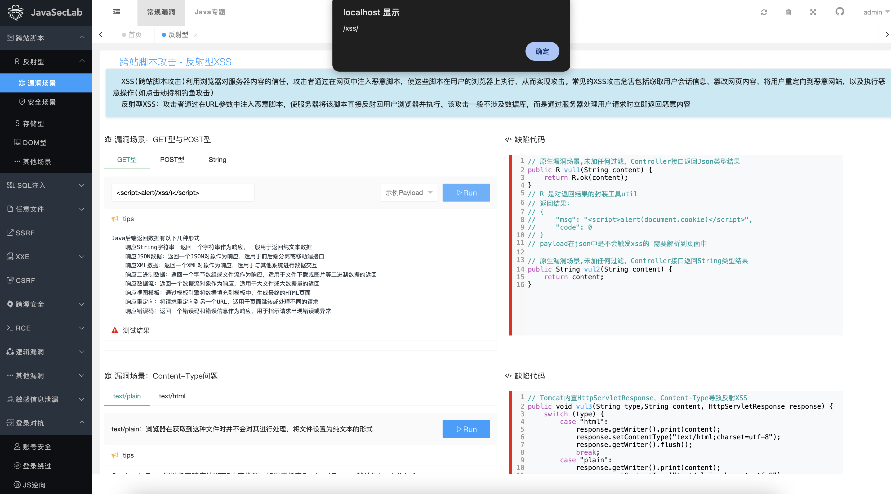
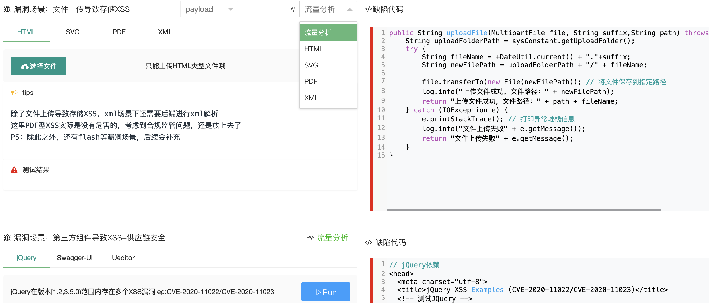
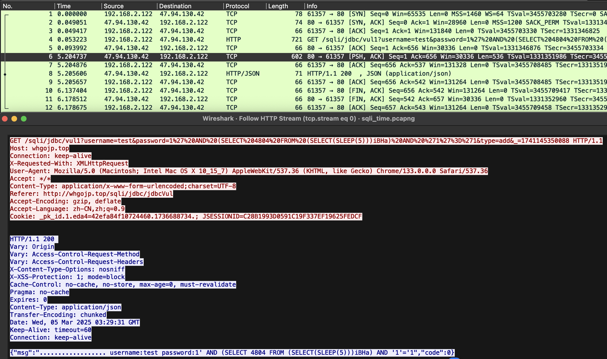

# JavaSecLab 一款综合Java漏洞平台

<div align="center">
  <a href="https://www.apache.org/licenses/LICENSE-2.0.html"></a>
  <a href="https://github.com/whgojp/JavaSecLab"></a>
  <a href="https://github.com/whgojp/JavaSecLab"></a>
  <a href="https://blog.csdn.net/weixin_53009585"></a>
    
  
</div>


----------------------------------------

## 项目介绍
​	JavaSecLab是**一款综合型Java漏洞平台**，提供相关漏洞缺陷代码、修复代码、漏洞场景、审计SINK点、安全编码规范、漏洞流量分析，覆盖多种漏洞场景，友好用户交互UI…… 




## 面向人群

- 安全服务方面：帮助安全服务人员理解漏洞原理(产生、修复、审计)，以及对应漏洞流量分析

- 甲方安全方面：可作为开发安全培训演示，友好的交互方式，帮助研发同学更容易理解漏洞

- 安全研究方面：各种漏洞的不同触发场景，可用于xAST等安全工具测试


## 支持漏洞模块

- 跨站脚本攻击、跨站请求伪造、CORS、JSONP、URL重定向、XFF伪造、拒绝服务、XPATH注入

- SQL注入、任意文件系列、跨服务端请求伪造、XML实体注入、RCE

- 逻辑漏洞(IDOR、验证码安全、支付安全、并发安全)、敏感信息泄漏系列、登录对抗系列

- SPEL注入、SSTI注入、反序列化、组件漏洞


## 在线环境体验

http://whgojp.top/

账号密码：admin/admin

## 项目灵感

​	曾在甲方单位工作过一段时间，有机会接触到完整的**漏洞生命周期**：很多次做完渗透测试后，通过(TAPD、Jira)发送工单通知研发同学修复漏洞，经常面临着一些问题：**1、研发不知道为什么这是个漏洞？2、研发不知道这个漏洞怎么修复？**
​	由此，一个想法💡油然而生，恰巧自己也懂些开发知识，想着可不可以通过代码的方式让研发同学快速了解漏洞的产生与修复……

> 平台提供相关漏洞的安全编码规范，甲方朋友在做SDL/DevSecOps建设的时候，可以考虑加入开发安全培训这一环节

​	此外，自己也做过安全服务类项目，我想大部分朋友会和我一下，只是按照 信息收集->外网打点->发现漏洞->输出报告 这个流程测试，对于漏洞怎么产生、怎么修复，似乎并不关心……

​	代码审计过程中，通常是先定位SINK点(即代码执行或输出的关键位置)，然后再回溯寻找对应的SOURCE点(即输入或数据来源的位置)。通过将SOURCE点和SINK点串联起来，来完成代码审计工作

> 平台针对每种漏洞提供对应缺陷代码、多种安全安全修复方式(例如：1、升级修复 2、非升级修复)，同时针对代码审计，平台也提供相关漏洞的SINK点

​	再后来，接触了应用安全产品，SCA、SAST、DAST、RASP等，看待安全漏洞似乎又是另一种角度，对于客户来说，采购的安全工具，无论是扫源码、容器、镜像……，都希望尽可能的扫到更多的漏洞，当然也希望少点误报，笔者也或多或少接触到可达性分析等相关技术，项目中也针对每种漏洞编写了不同的触发场景，感兴趣的朋友可以测试一下……

> 平台针对同种漏洞提供多种触发场景

🆕 更新漏洞流量分析模块，方便师傅们参考学习，以本项目漏洞流量为例，如果您有更好的漏洞流量数据包，欢迎提PR参与项目🌹



这里以延时注入为例：可以从响应时间明显的看到其流量特征：5秒后服务器响应



## 技术架构

​	SpringBoot + Spring Security + MyBatis + Thymeleaf + Layui

## 部署方式

先clone下项目代码

```shell
git clone https://github.com/whgojp/JavaSecLab.git
```


### 本地部署-IDEA

> JDK环境 1.8

1. 配置数据库(**Mysql 8.0+**)

   执行 sql/JavaSecLab.sql 文件

   修改配置文件application.yml active为dev(项目默认为docker 如果搭建的过程中出现数据库连接错误 师傅们可以注意下这里)

   ```yaml
   spring:
     # 环境 dev|docker
     profiles:
       active: dev
   ```
   
2. 修改application-dev.yml配置文件

```yaml
username: root
password: QWE123qwe
url: jdbc:mysql://localhost:13306/JavaSecLab?characterEncoding=utf8&zeroDateTimeBehavior=convertToNull&useSSL=false&useJDBCCompliantTimezoneShift=true&useLegacyDatetimeCode=false&serverTimezone=GMT%2B8&nullCatalogMeansCurrent=true&allowPublicKeyRetrieval=true&allowMultiQueries=true
```


初始账号密码：admin/admin(后台可修改)

### Docker部署(推荐)

> 条件：已安装docker和docker-compose
>
> docker部署过程中 sql文件没有初始化执行的话(即数据库为空) 需要手动导入下sql文件

```shell
mvn clean package -DskipTests
docker-compose -p javaseclab up -d
```


更多部署方案、部署问题解答详见：[部署指南](https://github.com/whgojp/JavaSecLab/wiki/%E9%83%A8%E7%BD%B2%E6%8C%87%E5%8D%97)

## 开源协议

​	**When we speak of free software, we are referring to freedom, not price.**

本项目遵循 [Apache License 2.0](http://www.apache.org/licenses/LICENSE-2.0) 协议，详细的许可证内容请参见项目中的 [LICENSE](./LICENSE) 文件。

## 更新记录

项目的详细更新记录请参阅 [更新日志](https://github.com/whgojp/JavaSecLab/wiki/%E6%9B%B4%E6%96%B0%E6%97%A5%E5%BF%97)

## 一些Tips🙋

1. 安全问题：由于是漏洞靶场，因此不建议搭建在公网上使用
1. 项目中的安全修复代码仅供参考，实际业务中漏洞修复起来可能要复杂的多……
1. **问题/建议反馈：如果遇到一些项目问题或者更好的建议，欢迎各位师傅可以提Issue或加交流群进行反馈**
1. **看到这里，师傅觉得项目有用的话，麻烦动动手点个star吧，非常感谢🙏**

## 关于作者

作者博客：[今天是几号](https://blog.csdn.net/weixin_53009585)

**如果师傅同样对开发安全、应用安全、SDL、漏洞靶场等感兴趣的话，欢迎加交流群一起探讨……**

<div style="text-align: center;">
    
      
</div>


## 赞助开源

​	如果您觉得这个工具对您有帮助，不妨考虑支持一下作者的开发工作。您的赞助将用于维护在线服务器和持续优化项目功能，非常感谢您的鼓励和支持！

<div style="text-align: center;">
    
  </div>


