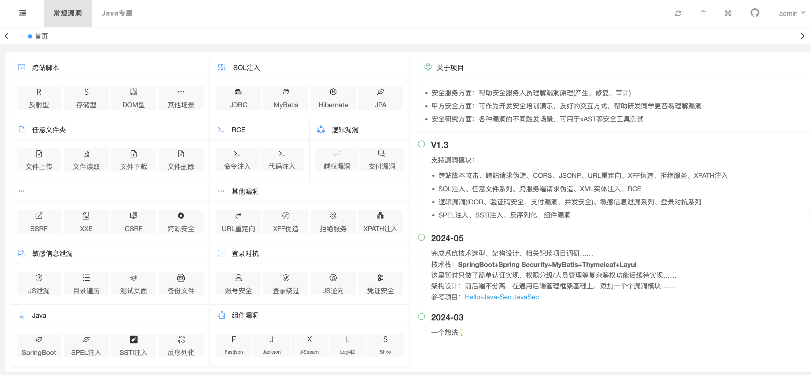
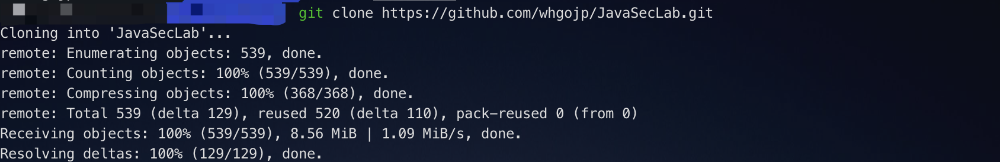
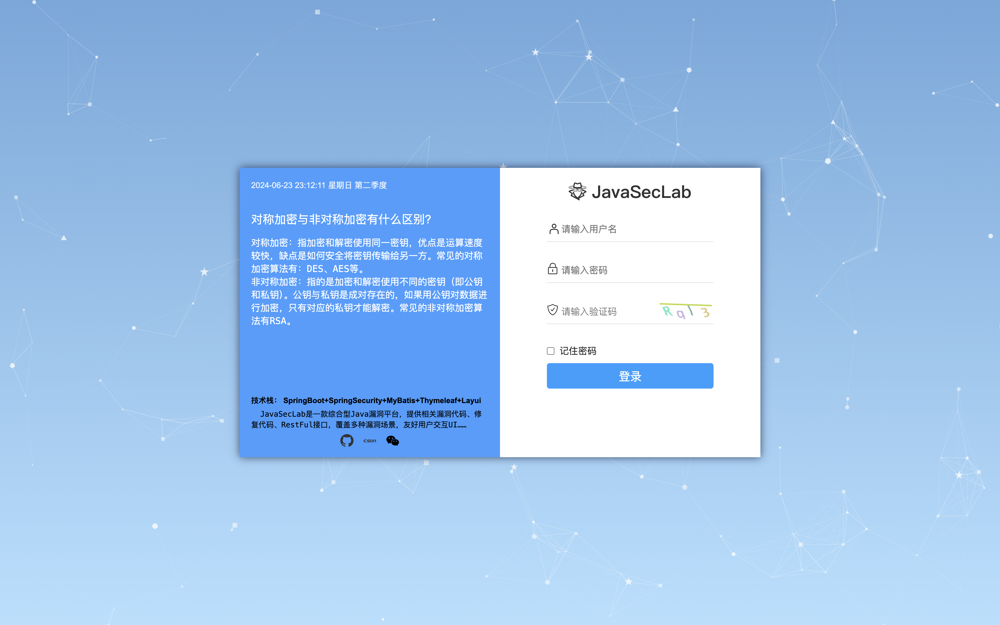
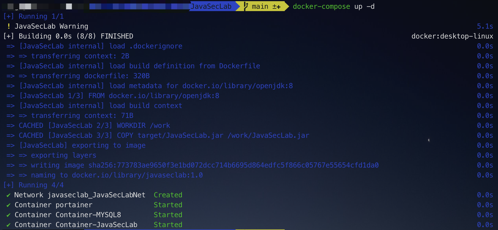
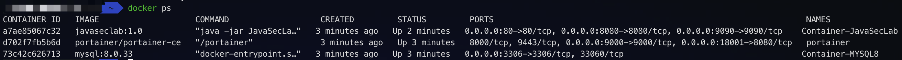

# JavaSecLab 一款综合Java漏洞平台

<p align="center">
<a href="https://www.apache.org/licenses/LICENSE-2.0.html"></a>

<a href="https://github.com/whgojp/JavaSecLab"></a>
<a href="https://blog.csdn.net/weixin_53009585"></a>
</p>

----------------------------------------

## 项目介绍
​	JavaSecLab是一款综合型Java漏洞平台，提供相关缺陷代码、修复代码、漏洞场景、审计SINK点、安全编码规范，覆盖多种漏洞场景，友好用户交互UI…… 




## 面向人群

- 安全服务方面：帮助安全服务人员理解漏洞原理(产生、修复、审计)
- 甲方安全方面：可作为开发安全培训演示，友好的交互方式，帮助研发同学更容易理解漏洞
- 安全研究方面：各种漏洞的不同触发场景，可用于xAST等安全工具测试

## 项目灵感

​	实习期间在甲方单位待了半年多，有机会可以接触到完整的**漏洞生命周期**：很多次做完渗透测试后，通过(TAPD、Jira)发送工单通知研发朋友修复漏洞，经常面临着一些问题：**1、研发不知道为什么这是个漏洞？2、研发不知道这个漏洞怎么修复？**
​	由此，一个想法💡油然而生，恰巧自己也懂些开发知识，想着可不可以通过代码的方式让研发朋友快速了解漏洞的产生与修复……

> 平台提供相关漏洞的安全编码规范，甲方朋友在做SDL/DevSecOps建设的时候，可以考虑加入开发安全培训这一环节

​	此外，自己也做过安全服务类项目，我想大部分朋友会和我一下，只是按照 信息收集->外网打点->发现漏洞->输出报告 这个流程测试，对于漏洞怎么产生、怎么修复，似乎并不关心……

​	代码审计过程中，通常是先定位SINK点(即代码执行或输出的关键位置)，然后再回溯寻找对应的SOURCE点(即输入或数据来源的位置)。通过将SOURCE点和SINK点串联起来，呐，这就是代码审计

> 平台针对每种漏洞提供对应缺陷代码、多种安全安全修复方式(例如：1、升级修复 2、非升级修复)，同时针对代码审计，平台也提供相关漏洞的SINK点

​	再后来，接触了应用安全产品，SCA、SAST、DAST、RASP等，看待安全漏洞似乎又是另一种角度，对于客户来说，采购的安全工具，无论是扫源码、容器、镜像……，都希望尽可能的扫到更多的漏洞，当然也希望少点误报，笔者也或多或少接触到可达性分析等相关技术，想想看，茴香豆的"茴"都有4种写法，一个漏洞的触发方式当然也不尽相同，所以项目中也针对每种漏洞编写了不同的触发场景，感兴趣的朋友可以测试一下……

> 平台针对同种漏洞提供多种触发场景

## 技术架构

​	SpringBoot + Spring Security + MyBatis + Thymeleaf + Layui

## 部署方式

先clone下项目代码

```shell
git clone https://github.com/whgojp/JavaSecLab.git
```



### 原生部署-IDEA

> JDK环境 1.8

1. 配置数据库(**Mysql 8.0+**)

   执行 sql/JavaSecLab.sql 文件

   修改配置文件application.yml active为prod(项目默认为docker)

   ```yaml
   spring:
     # 环境 dev|docker
     profiles:
       active: dev
   ```
   
2. 修改application-dev.yml配置文件

```yaml
username: root
password: QWE123qwe
url: jdbc:mysql://localhost:13306/JavaSecLab?characterEncoding=utf8&zeroDateTimeBehavior=convertToNull&useSSL=false&useJDBCCompliantTimezoneShift=true&useLegacyDatetimeCode=false&serverTimezone=GMT%2B8&nullCatalogMeansCurrent=true&allowPublicKeyRetrieval=true&allowMultiQueries=true
```



初始账号密码：admin/admin(后台可修改)

### Docker部署(推荐)

> 条件：已安装docker和docker-compose

```shell
mvn clean package -DskipTests
docker-compose -p javaseclab up -d
```





## TodoList

- [ ] 跨站脚本模块实现
- [ ] SQL注入模块实现
- [ ] 任意文件类模块实现

## 开源协议

​	**When we speak of free software, we are referring to freedom, not price.**

本项目遵循 [Apache License 2.0](http://www.apache.org/licenses/LICENSE-2.0) 协议，详细的许可证内容请参见项目中的 [LICENSE](./LICENSE) 文件。

## 一些Tips🤔

1. 安全问题：由于是漏洞靶场，因此不建议搭建在公网上使用

## 关于作者

作者博客：https://blog.csdn.net/weixin_53009585

作者微信


