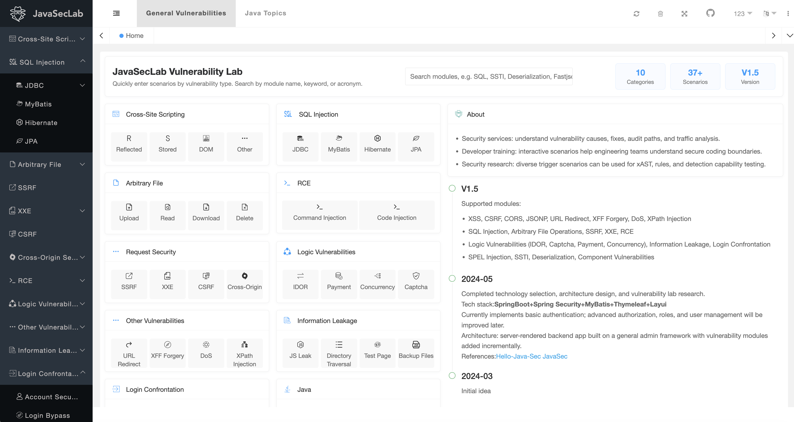
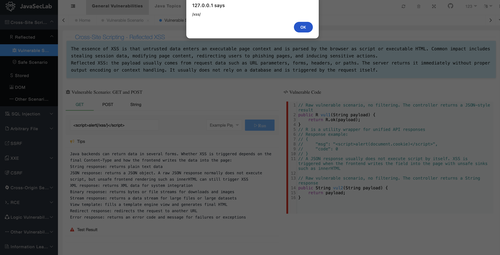
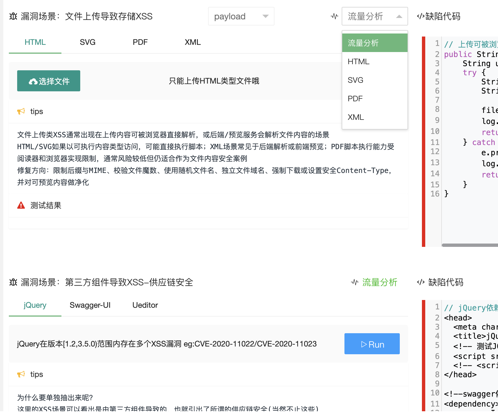
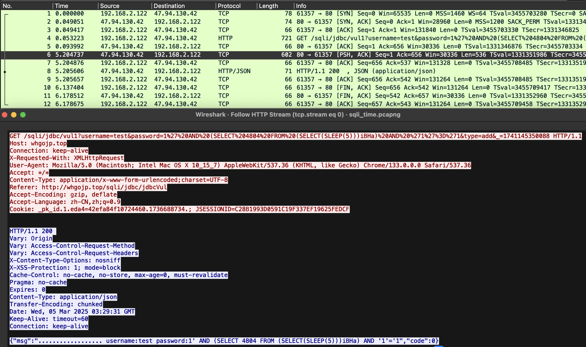
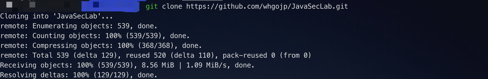
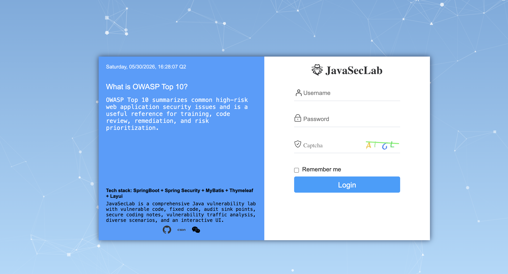
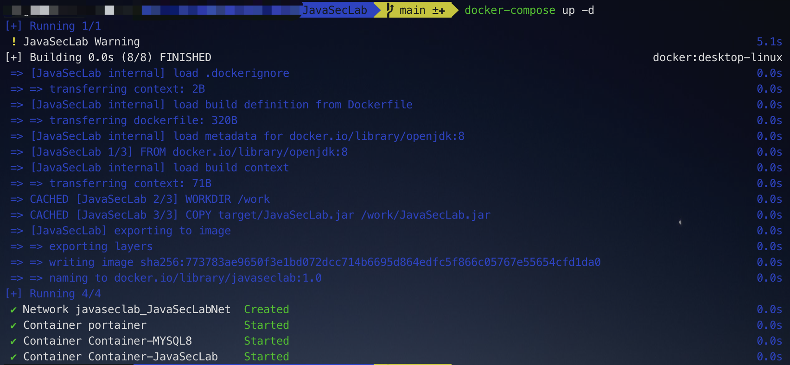
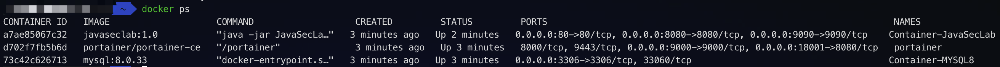
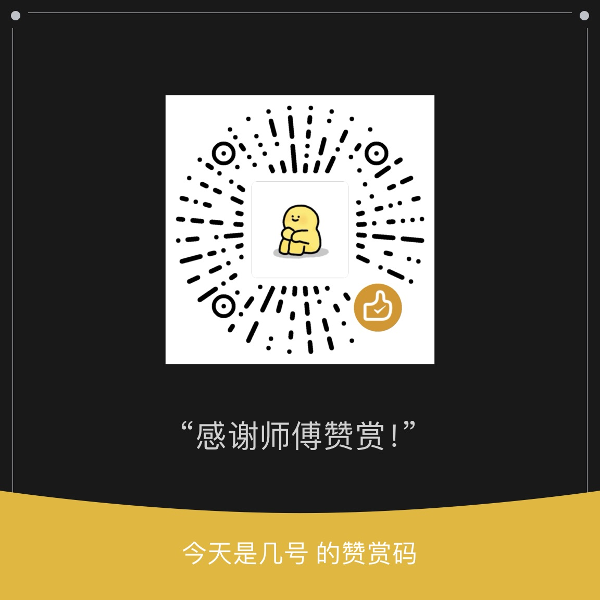

#  JavaSecLab - A Comprehensive Java Vulnerability Lab

<div align="center">
  <a href="https://www.apache.org/licenses/LICENSE-2.0.html"></a>
  <a href="https://github.com/whgojp/JavaSecLab"></a>
  <a href="https://github.com/whgojp/JavaSecLab"></a>
  <a href="https://blog.csdn.net/weixin_53009585"></a>
  
  
</div>

[中文文档](./README_ZH.md)

----------------------------------------

## Overview

JavaSecLab is a comprehensive Java vulnerability lab for application security learning, code audit practice, secure development training, and security tool evaluation. Built on Spring Boot, it provides vulnerable code, fixed implementations, realistic attack scenarios, audit-oriented source and sink notes, remediation guidance, secure coding explanations, and traffic-analysis examples.

The goal is practical: help users understand not only how a vulnerability is exploited, but also why it exists in code and how it should be fixed.





## Who Is It For?

- **Security service teams**: explain vulnerability causes, exploitation paths, fixes, audit flows, and traffic patterns.
- **Enterprise security teams**: use it for SDL, DevSecOps, secure development training, and security awareness programs.
- **Security researchers**: test SAST, DAST, IAST, RASP, SCA, xAST, reachability analysis, and other security tools.
- **Java developers**: learn common application security issues from real code instead of abstract checklists.

## Vulnerability Modules

JavaSecLab covers a wide range of Java web security scenarios, including:

- XSS, CSRF, CORS, JSONP, URL redirection, XFF spoofing, denial of service, and XPath injection
- SQL injection, arbitrary file read/upload/download/delete, SSRF, XXE, and RCE
- Business logic flaws: IDOR, captcha security, payment security, and concurrency security
- Sensitive information disclosure, login confrontation, request signing, and JWT credential security
- SpEL injection, SSTI, and Java deserialization
- Fastjson, Jackson, XStream, Log4j2, Shiro, SnakeYAML, XMLDecoder, and other component/ecosystem cases
- Spring Boot ecosystem exposure: Swagger, Actuator, Druid, MySQL JDBC deserialization, and more

## Online Demo

Demo site: <http://whgojp.top/>

Default account: `admin/admin`

> JavaSecLab is intentionally vulnerable and contains dangerous endpoints, vulnerable dependencies, and insecure configurations. Run your own deployment only in an isolated environment. Do not expose it directly to the public internet.

## Why This Project Exists

The author has worked in enterprise security roles and experienced the full vulnerability lifecycle. After penetration tests or security assessments, vulnerabilities are often assigned to development teams through systems such as TAPD or Jira. In practice, two questions come up repeatedly:

1. Why is this behavior a vulnerability?
2. How should this vulnerability be fixed?

JavaSecLab was created to connect vulnerability behavior, vulnerable code, remediation approaches, and audit thinking. Compared with a text-only report or a PoC, the project emphasizes understanding vulnerabilities from the code perspective.

In code auditing, a common workflow is to locate a **sink** first, such as command execution, SQL execution, file access, template rendering, deserialization, or response output. The auditor then traces backward to identify the corresponding **source**, such as request parameters, headers, cookies, uploaded files, serialized data, or database content. Many JavaSecLab scenarios are designed around this source-to-sink path, making them useful for both learning and tool verification.

The same vulnerability type often appears through multiple trigger paths in real systems. JavaSecLab therefore provides multiple scenarios for core vulnerability classes where possible, so users can compare how different coding patterns, framework features, and business flows affect risk.

## Traffic Analysis

JavaSecLab includes vulnerability traffic-analysis examples to help learners connect request/response behavior with code execution. Contributions with clearer packets, better reproduction notes, or additional analysis examples are welcome.



For example, in a time-based SQL injection scenario, the traffic pattern can be observed through response latency: the server responds after roughly five seconds.



## Tech Stack

- Spring Boot
- Spring Security
- MyBatis / MyBatis-Plus
- JPA / Hibernate
- Thymeleaf
- Layui
- MySQL

## Deployment

Clone the repository:

```shell
git clone https://github.com/whgojp/JavaSecLab.git
cd JavaSecLab
```



### Local Deployment with IDEA

Requirements:

- JDK 8
- MySQL 8.0+
- Maven

1. Create the database and import [sql/JavaSecLab.sql](./sql/JavaSecLab.sql).
2. Set the active profile to `dev` in [src/main/resources/application.yml](./src/main/resources/application.yml):

   ```yaml
   spring:
     profiles:
       active: dev
   ```

3. Update the database connection in [src/main/resources/application-dev.yml](./src/main/resources/application-dev.yml):

   ```yaml
   username: root
   password: QWE123qwe
   url: jdbc:mysql://localhost:13306/JavaSecLab?characterEncoding=utf8&zeroDateTimeBehavior=convertToNull&useSSL=false&useJDBCCompliantTimezoneShift=true&useLegacyDatetimeCode=false&serverTimezone=GMT%2B8&nullCatalogMeansCurrent=true&allowPublicKeyRetrieval=true&allowMultiQueries=true
   ```

4. Start the application from IDEA or with Maven.

Default account: `admin/admin`



### Docker Deployment

Requirements:

- Docker
- Docker Compose

Build and start the lab:

```shell
mvn clean package -DskipTests
docker-compose -p javaseclab up -d
```

If the database is empty after startup, manually import [sql/JavaSecLab.sql](./sql/JavaSecLab.sql).





For more deployment options and troubleshooting notes, see the [Deployment Guide](https://github.com/whgojp/JavaSecLab/wiki/%E9%83%A8%E7%BD%B2%E6%8C%87%E5%8D%97).

## Security Notice

JavaSecLab is a vulnerable lab project. It intentionally keeps dangerous endpoints, vulnerable dependencies, and insecure configurations for reproduction and teaching. Run it only locally or in an isolated network.

Recommended precautions:

- Do not deploy JavaSecLab directly on a public network.
- Use disposable accounts, test databases, and isolated containers.
- Do not mount sensitive host directories into the container.
- Review exposed ports before running Docker Compose.
- Treat uploaded files, generated files, and logs as untrusted data.

The secure code examples in this project are for teaching and demonstration. Real business systems usually require authentication, auditing, rate limiting, data validation, dependency governance, monitoring, alerting, and defense in depth.

## Contributing

Issues and pull requests are welcome. Good contributions include:

- New vulnerability scenarios with clear vulnerable and fixed code
- More accurate source/sink notes and code-audit explanations
- Better vulnerability traffic packets and analysis notes
- Deployment fixes and documentation improvements
- UI and interaction improvements that make the lab easier to teach with

## License

**When we speak of free software, we are referring to freedom, not price.**

JavaSecLab is released under the [Apache License 2.0](http://www.apache.org/licenses/LICENSE-2.0). See [LICENSE](./LICENSE) for details.

## Changelog

See the [Update Log](https://github.com/whgojp/JavaSecLab/wiki/%E6%9B%B4%E6%96%B0%E6%97%A5%E5%BF%97) for release notes and project history.

## Author

Author's blog: [今天是几号](https://blog.csdn.net/weixin_53009585)

If you are interested in application security, secure development, SDL, DevSecOps, or vulnerability labs, feel free to join the community group.

<div style="text-align: center;">
  
  
</div>

## Sponsorship

If JavaSecLab helps you, sponsorship is appreciated. Support will be used for maintaining the online environment and continuously improving the project.

<div style="text-align: center;">
  
</div>
