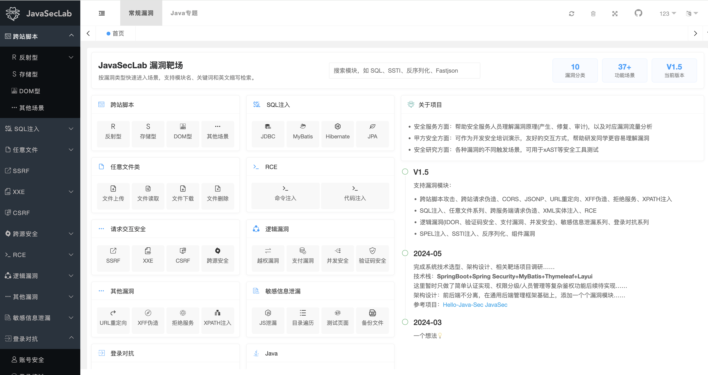
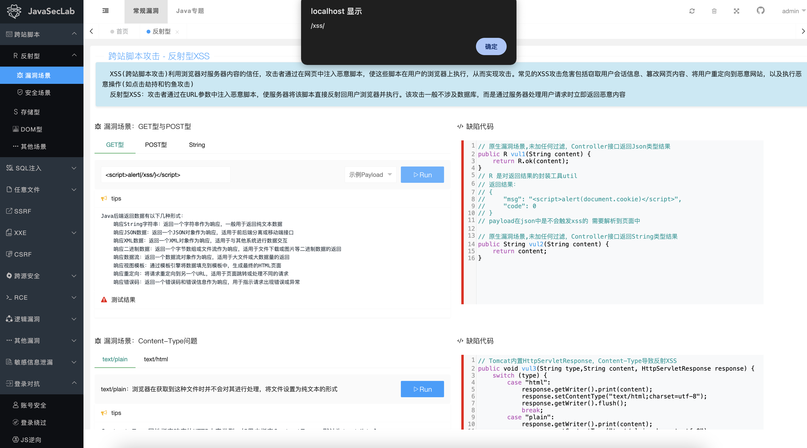
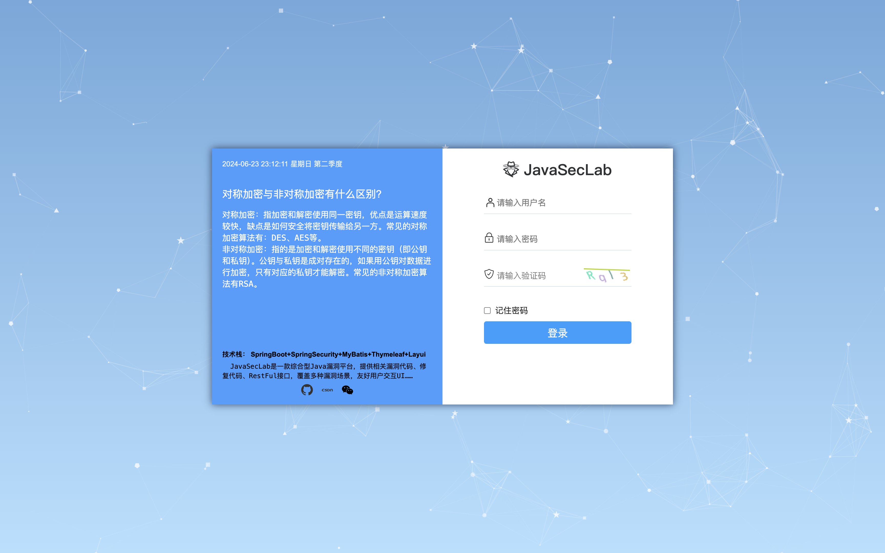

#  JavaSecLab - 综合型 Java 漏洞靶场

<div align="center">
  <a href="https://www.apache.org/licenses/LICENSE-2.0.html"></a>
  <a href="https://github.com/whgojp/JavaSecLab"></a>
  <a href="https://github.com/whgojp/JavaSecLab"></a>
  <a href="https://blog.csdn.net/weixin_53009585"></a>
  
  
</div>

[English](./README.md)

----------------------------------------

## 项目介绍

JavaSecLab 是一款面向应用安全学习、代码审计训练、开发安全培训和安全工具测试的综合型 Java 漏洞靶场。项目基于 Spring Boot 构建，围绕真实 Java Web 项目中常见的漏洞入口，提供缺陷代码、修复代码、漏洞场景、审计 Source/Sink、修复思路、安全编码说明和漏洞流量分析。

项目希望解决一个很实际的问题：不仅让使用者知道“漏洞怎么打”，也能看清“漏洞为什么会在代码里产生，以及应该如何修”。





## 适用人群

- **安全服务人员**：用于讲解漏洞原理、触发方式、修复方案、审计路径和流量特征。
- **企业安全团队**：作为 SDL、DevSecOps、开发安全培训和安全意识建设的演示平台。
- **安全研究人员**：用于测试 SAST、DAST、IAST、RASP、SCA、xAST、可达性分析等安全工具。
- **Java 研发同学**：通过真实代码理解常见安全问题，避免只停留在抽象规范和检查清单。

## 漏洞模块

JavaSecLab 覆盖多类 Java Web 安全场景，包括：

- 跨站脚本、跨站请求伪造、CORS、JSONP、URL 重定向、XFF 伪造、拒绝服务、XPath 注入
- SQL 注入、任意文件读取/上传/下载/删除、SSRF、XXE、RCE
- 逻辑漏洞：越权访问、验证码安全、支付安全、并发安全
- 敏感信息泄漏、登录对抗、请求签名、JWT 凭证安全
- SpEL 表达式注入、SSTI 模板注入、Java 反序列化
- Fastjson、Jackson、XStream、Log4j2、Shiro、SnakeYAML、XMLDecoder 等组件与生态场景
- Spring Boot 生态暴露面：Swagger、Actuator、Druid、MySQL JDBC 反序列化等

## 在线体验

在线地址：<http://whgojp.top/>

默认账号：`admin/admin`

> JavaSecLab 是漏洞靶场，包含故意保留的漏洞代码、危险依赖和不安全配置。自行部署时请放在隔离环境中，不建议直接暴露到公网。

## 项目初衷

作者曾在甲方单位接触过比较完整的漏洞生命周期：渗透测试或安全评估结束后，通过 TAPD、Jira 等系统把漏洞工单发送给研发同学修复。但在实际沟通过程中，经常会遇到两个问题：

1. 研发同学不知道为什么这是一个漏洞。
2. 研发同学不知道这个漏洞应该怎样修复。

JavaSecLab 的出发点就是把漏洞现象、代码缺陷、修复方案和审计思路串起来。相比只给出文字报告或 PoC，本项目更强调从代码视角理解漏洞产生的原因。

在代码审计中，常见方法是先定位 **Sink 点**，例如命令执行、SQL 执行、文件访问、模板渲染、反序列化、响应输出等关键位置；再向上回溯 **Source 点**，例如请求参数、Header、Cookie、上传文件、序列化数据、数据库内容等输入来源。JavaSecLab 的很多场景都围绕 Source 到 Sink 的链路设计，便于学习和工具验证。

同一种漏洞在真实业务中往往有多种触发路径。因此项目也尽量为核心漏洞补充多个场景，帮助使用者理解不同代码写法、框架特性和业务流程下的风险差异。

## 流量分析

项目内置了部分漏洞流量分析内容，方便结合请求包、响应包和代码行为理解漏洞特征。如果你有更清晰的漏洞流量包、复现说明或分析样例，欢迎提交 PR 一起完善。


以延时注入为例，可以从响应时间上观察到明显特征：服务端约 5 秒后返回响应。


## 技术栈

- Spring Boot
- Spring Security
- MyBatis / MyBatis-Plus
- JPA / Hibernate
- Thymeleaf
- Layui
- MySQL

## 部署方式

克隆项目：

```shell
git clone https://github.com/whgojp/JavaSecLab.git
cd JavaSecLab
```


### 本地部署 IDEA

环境要求：

- JDK 8
- MySQL 8.0+
- Maven

1. 创建数据库并导入 [sql/JavaSecLab.sql](./sql/JavaSecLab.sql)。
2. 修改 [src/main/resources/application.yml](./src/main/resources/application.yml)，将环境切换为 `dev`：

   ```yaml
   spring:
     profiles:
       active: dev
   ```

3. 修改 [src/main/resources/application-dev.yml](./src/main/resources/application-dev.yml) 中的数据库连接信息：

   ```yaml
   username: root
   password: QWE123qwe
   url: jdbc:mysql://localhost:13306/JavaSecLab?characterEncoding=utf8&zeroDateTimeBehavior=convertToNull&useSSL=false&useJDBCCompliantTimezoneShift=true&useLegacyDatetimeCode=false&serverTimezone=GMT%2B8&nullCatalogMeansCurrent=true&allowPublicKeyRetrieval=true&allowMultiQueries=true
   ```

4. 使用 IDEA 启动项目，或通过 Maven 启动。

默认账号：`admin/admin`



### Docker 部署

环境要求：

- Docker
- Docker Compose

方式一：直接使用已发布镜像启动：

```shell
docker compose -f docker-compose.image.yml up -d
```

方式二：本地构建镜像并启动：

```shell
mvn clean package -DskipTests
docker compose -p javaseclab up -d
```

如果容器启动后数据库为空，请手动导入 [sql/JavaSecLab.sql](./sql/JavaSecLab.sql)。


更多部署方案和常见问题见：[部署指南](https://github.com/whgojp/JavaSecLab/wiki/%E9%83%A8%E7%BD%B2%E6%8C%87%E5%8D%97)

## 安全提示

JavaSecLab 为漏洞靶场项目，包含故意保留的危险接口、漏洞依赖和不安全配置。请只在本地或隔离网络中运行。

建议注意：

- 不要把靶场直接部署到公网。
- 使用一次性账号、测试数据库和隔离容器环境。
- 不要把宿主机敏感目录挂载进容器。
- 启动 Docker Compose 前检查暴露端口。
- 将上传文件、生成文件和日志都视为不可信数据。

项目中的安全修复代码用于教学和演示，真实业务系统通常还需要结合鉴权、审计、限流、数据校验、依赖治理、监控告警和纵深防御。

## 贡献

欢迎提交 Issue 或 Pull Request。比较适合贡献的内容包括：

- 新漏洞场景，以及对应的缺陷代码和修复代码
- 更准确的 Source/Sink 说明和代码审计笔记
- 更清晰的漏洞流量包和流量分析说明
- 部署问题修复和文档改进
- 更适合教学演示的交互和页面优化

## 开源协议

**When we speak of free software, we are referring to freedom, not price.**

本项目遵循 [Apache License 2.0](http://www.apache.org/licenses/LICENSE-2.0) 协议，详细内容请参见 [LICENSE](./LICENSE)。

## Star History

<picture>
  <source
    media="(prefers-color-scheme: dark)"
    srcset="https://api.star-history.com/svg?repos=whgojp/JavaSecLab&type=Date&theme=dark"
  />
  <source
    media="(prefers-color-scheme: light)"
    srcset="https://api.star-history.com/svg?repos=whgojp/JavaSecLab&type=Date"
  />
  
</picture>

## 更新记录

项目详细更新记录见：[更新日志](https://github.com/whgojp/JavaSecLab/wiki/%E6%9B%B4%E6%96%B0%E6%97%A5%E5%BF%97)

## 关于作者

作者博客：[今天是几号](https://blog.csdn.net/weixin_53009585)

如果你同样关注应用安全、开发安全、SDL、DevSecOps 或漏洞靶场，欢迎加入交流群一起讨论。

<div style="text-align: center;">
  
  
</div>

## 赞助开源

如果 JavaSecLab 对你有帮助，欢迎支持作者继续维护。赞助将用于在线环境维护和项目功能持续优化，感谢你的鼓励和支持。

<div style="text-align: center;">
  
</div>
